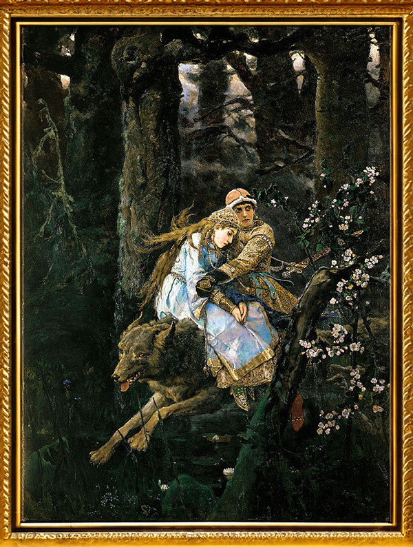

  <!-- Icône cliquable 1 -->
  

<!--

<h1 align="center">Salut, moi c'est Ton Prénom 👋</h1>

Bienvenue sur mon GitHub ! Voici un aperçu interactif de mes projets 👇

  

<map name="projects">
  <area shape="rect" coords="50,50,150,150" href="https://github.com/tonpseudo/projet1" alt="Projet 1" />
  <area shape="rect" coords="200,50,300,150" href="https://github.com/tonpseudo/projet2" alt="Projet 2" />
  <area shape="rect" coords="350,50,450,150" href="https://github.com/tonpseudo/projet3" alt="Projet 3" />
  Ajoute autant de zones que nécessaire
</map>

---

🎨 **Chaque icône est cliquable !**
N'hésite pas à explorer mes projets en cliquant sur l'image ci-dessus.

**Ravaill-hack/Ravaill-hack** is a ✨ _special_ ✨ repository because its `README.md` (this file) appears on your GitHub profile.

Here are some ideas to get you started:

- 🔭 I’m currently working on ...
- 🌱 I’m currently learning ...
- 👯 I’m looking to collaborate on ...
- 🤔 I’m looking for help with how to make seitan
- 💬 Ask me about 19th century architecture
- 📫 How to reach me: ...
- ⚡ Fun fact: ...
-->
